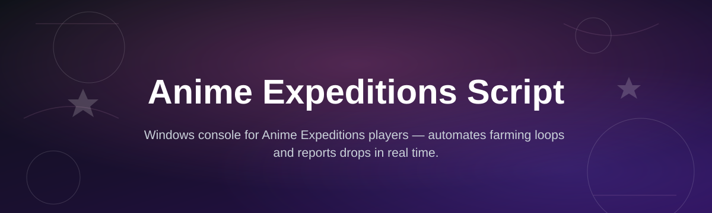
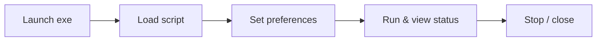

# anime-expeditions-dc-console

*A standalone console for running the Anime Expeditions Script without touching a browser dev tools panel every session.*

## What this is

anime-expeditions-dc-console is a desktop console built around the Anime Expeditions Script — a Discord-activity companion tool for the Anime Expeditions experience. Instead of pasting snippets into a browser console each time you want to run a routine, this app gives you a persistent window: start it, pick your settings, hit run, and it manages the script's lifecycle for you.

The console wraps the script logic in a lightweight Windows executable. No terminal, no build step, no dependency hunting. It's built for people who already know what Anime Expeditions Script does and just want a faster, more reliable way to launch it every time they play.

  

The button above opens the project landing page, where you download the latest build.

## Who it is for

| Audience | Why they use it |
|---|---|
| Players running Anime Expeditions daily | Skip the manual console paste-and-run cycle |
| Users who prefer a real window over browser overlays | Console stays open independent of the browser tab |
| People who restart their setup often | One executable, no reinstall of dependencies each time |
| Users on shared or borrowed PCs | Standalone `.exe`, nothing installed system-wide |

## What you can do

| Capability | Detail |
|---|---|
| **Launch the script from one window** | No copy-pasting into a browser console every session |
| **Save your run settings** | Preferences persist between launches |
| **View live status output** | See what the script is doing without opening dev tools |
| **Stop and restart on demand** | Clean shutdown instead of closing a browser tab mid-run |
| **Run without an internet toolchain** | No npm, no pip, no build environment required |
| **Keep a small footprint** | Single executable, minimal background resource use |
| **Update independently of the browser** | New builds ship from the landing page, not an extension store |
| **Use offline once downloaded** | Only needs a connection for the activity itself, not the console |

## Getting started

1. Open the landing page using the download button above.
2. Download the latest `anime-expeditions-dc-console` build for Windows.
3. Extract the folder if it's zipped.
4. Run the `.exe` — no installer, no setup wizard.
5. Configure your run settings in the console window and start the script.

## Requirements

- Windows 10 or Windows 11 (64-bit)
- No Node.js, Python, or other toolchain needed
- No admin rights required for standard use
- Roughly 50 MB of free disk space

## How it works

1. You launch the executable directly — nothing installs to your system.
2. The console loads the current Anime Expeditions Script logic internally.
3. You set your preferences (run mode, timing, output verbosity).
4. The console executes the script and streams status back to the window.
5. You stop the run or close the console; no residual background process.

## FAQ

**Is anime-expeditions-dc-console the same as the Anime Expeditions Script?**
It runs the same script logic, but packaged as a standalone Windows console instead of something you paste into a browser.

**Do I need to know how to code to use this?**
No. You download the executable, run it, and use the on-screen controls. No editing of script files is expected.

**Will this work on Mac or Linux?**
Not currently. It's built and tested for Windows 10/11 only.

**Does the console need to stay open while the script runs?**
Yes — closing the window stops the current run, the same way closing a browser tab would.

**Why use a console instead of running the script in the browser directly?**
Fewer steps per session, saved settings between runs, and no dependency on a specific browser or dev tools panel staying open.

## Troubleshooting

- **The console won't open / closes immediately.** Confirm you're on Windows 10/11 64-bit and that the file wasn't blocked by SmartScreen — right-click, Properties, Unblock.
- **Script runs but shows no output.** Check that your Discord activity window is active and focused before starting the run.
- **Settings don't save between sessions.** Make sure the extracted folder has write permission; running from a read-only or network drive can block this.
- **Antivirus flags the executable.** This happens with unsigned standalone `.exe` files generally; verify you downloaded from the official landing page before allowing it.

## License

Released under the [MIT License](LICENSE). This project is provided as-is, with no warranty. Use it at your own discretion within the terms of the platforms it interacts with.

  

